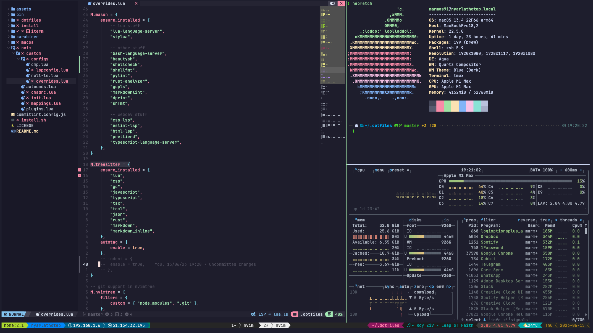
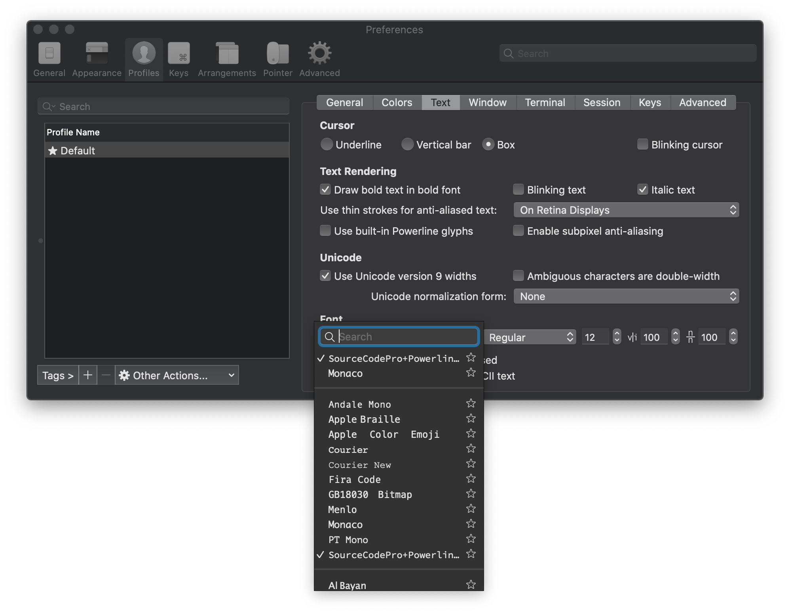

# marmos91 .files for macOS

Personal dotfiles repository.



## Highlights

- [Neovim](https://neovim.io/) configured through [NVChad](https://nvchad.com/)
- [Kitty](https://sw.kovidgoyal.net/kitty/) and [iTerm2](https://iterm2.com/) installed (Kitty used as main terminal emulator)
- [ZSH](https://www.zsh.org/) as default shell configured with [Oh My Zsh](https://ohmyz.sh/)
- Powerful terminal management through [Tmux](https://github.com/tmux/tmux/wiki)
- Support for Apple Silicon and Intel Macs

## How to install

First of all clone this repository

```bash
git clone https://github.com/marmos91/dotfiles.git
cd dotfiles
git submodule init
git submodule update
```

Run the following command

```bash
chmod +x ./install.sh
./install.sh
```

All the needed tools will be downloaded automatically.

## Customization

You are free to modify my configuration to suit your needs.

Here is a list of places to start:

- `[install/brew-cask.sh](./install/brew-cask.sh)`: contains all the applications
- `[install/brew.sh](./install/brew.sh)`: contains all the command line utilities
- `[install/fonts.sh](./install/fonts.sh)`: contains all the custom fonts
- `[install/mas.sh](./install/mas.sh)`: contains all the Mac App Store applications
- `[install/npm.sh](./install/npm.sh)`: contains all the node command line utilities
- `[install/zsh.sh](./install/zsh.sh)`: contains the list of all the zsh plugins

The config folder contains all the configurations of the applications we are going to install.
The most interesting path is definitely `config/nvim/lua/custom` where you can find my configuration for _neovim_.

Finally, the `dotfiles` folder contains all my personal dotfiles, feel free to modify them as you see fit.

## Acknowledgements

For many of the configurations you find I have taken cues from other amazing repositories.
I link them below because they can be inspiration for you as well:

- [https://github.com/joshukraine/dotfiles](https://github.com/joshukraine/dotfiles)
- [https://github.com/mathiasbynens/dotfiles](https://github.com/mathiasbynens/dotfiles)
- [https://github.com/alrra/dotfiles](https://github.com/alrra/dotfiles)
- [https://github.com/ThePrimeagen/.dotfiles](https://github.com/ThePrimeagen/.dotfiles)

## Setup iTerm color scheme and custom fonts

To install iTerm color schema and custom fonts open iTerm preferences and go to the `Profile` tab.
Under the `Text` tab select the `JetBrainsMono Nerd Font` font



## Enjoy

Enjoy your new terminal 😊

## License

[MIT LICENSE](./LICENSE)
